# 操作系统

### 1  操作系统的 ？？

#### 1.1 操作系统的概念、功能和目标

**概念**

操作系统(Operating System，OS):是指控制和管理整个计算机系统的硬件和软件资源（从中间向两头描述）；并合理的组织调度计算机的工作和资源分配（向下描述）；以提供给用户和其他软件方便的接口和环境（向上描述）。它是计算机系统中最基本的**系统软件**。

功能和目标

从下面3个点展开：

用“qq视频聊天”的例子，将操作系统作为系统资源的管理者所提供的4项功能串联起来。

最后，总结：

#### 1.2 操作系统的特征

操作系统的4个基本特征：

**概念**

- **并发**：宏观上同时发生，微观上是交替发生的。
  - 并行(易混)：同一时刻、同时发生。
  - 操作系统的并发性：指计算机系统中同时存在着多个运行着的程序。
    - 一个单核处理机(CPU)同一时刻只能执行一个程序，因此操作系统会负责协调多个程序交替执行（微观上交替执行、宏观上同时执行）
    - 事实上，操作系统就是伴随着“多道程序技术“而出现的，**因此操作系统和程序并发是一起诞生的。**
  - 当今的计算机，一般都是多核CPU---一个CPU多个核，比如Intel的i3就是4核CPU，这意味着：**微观上同一时刻可以有4个程序并行执行**。（很早之前是：一个CPU只有一个核：**微观上在同一时刻只能执行1个程序**）。几遍多核CPU出现，操作系统的**并发性依然必不可少**（除非出现100+核的CPU哈哈哈哈，毕竟一个电脑上同时工作的程序太多了）。
  
- **共享**：即资源共享，是指<u>系统中的资源</u>可供<u>内存中多个并发执行的进程</u>共同使用。
  - 两种资源共享方式：
    1. **互斥共享方式** （一个时间段内，**只允许一个进程**访问该资源）
    
       ​	eg. 微信视频聊天的时候 不能拍照。（同一时间段内，摄像头这个硬件资源是互斥共享方式的）
    
    2. **同时共享方式** （一个时间段内，**允许多个进程**<u>“同时”</u>访问该资源；“同时”：宏观上同时，微观上是多个进程**交替的访问**该资源。  其实(微观上)这个多个进程本身也是交替执行......）
    
       ​	eg1.对于一个文件可以同时：上传百度云+微信发给别人。（这两个进程同时读取并发送文件，说明这两个进程都在访问硬盘资源。   当然，微观上，这两个进程是在**交替着**访问硬盘的）
    
       ​	eg2.电脑扬声器可以同时发出：音乐、系统提示音、游戏音效等等。。（此时在微观上，扬声器这个硬件资源是被多个进程同时访问的）
    
       > 论证并发和共享的关系：**（互为存在条件）**
       >
       > A：如果失去了并发性，那么系统同一时刻就只能运行一个程序，那么共享性就失去了意义。
       >
       > ​	如果失去了共享性，那么多进程就不能同时访问同一个资源------>只能某个进程结束访问该资源后，另一个进程才可以访问。使得多进程的并发难以保证。
  
- **虚拟** ：指把一个<u>物理上的实体</u>变为若干个<u>逻辑上的对应物</u>。

  - 主要有两种虚拟技术：
    - 时分复用技术
    - 空分复用技术

- **异步**：进程不是一次性执行完毕，而是走走停停，以不可知的速度向前推进。

#### 1.3 操作系统的发展与分类

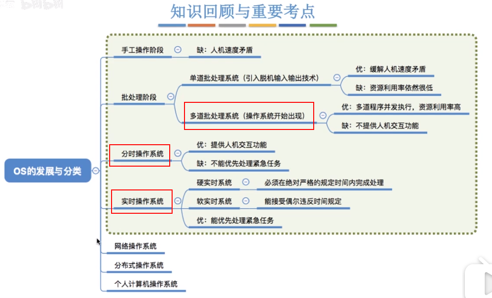

#### 1.4 操作系统的运行机制与体系结构

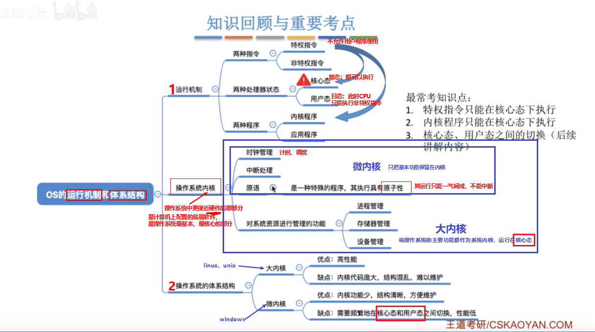

>  争论：微内核和宏内核（大内核）孰好孰坏？ 

 宏内核与微内核的区别也就在这吧，微内核是一个信息中转站，自身完成很少功能，主要是传递一个模块对另一个模块的功能请求，而宏内核则是一个大主管，把内存管理，文件管理等等一股脑全部接管。  

 **从理论上来看，微内核的思想更好些**，微内核把系统分为各个小的功能块，降低了设计难度，系统的维护与修改也容易，<u>但通信带来的效率损失是个问题</u>。宏内核的功能块之间的耦合度太高造成修改与维护的代价太高，不过在目前的Linux里面还不算大问题，因为Linux目前还不算太复杂，宏内核因为是直接调用，所以效率是比较高的。 

#### 1.5 中断和异常

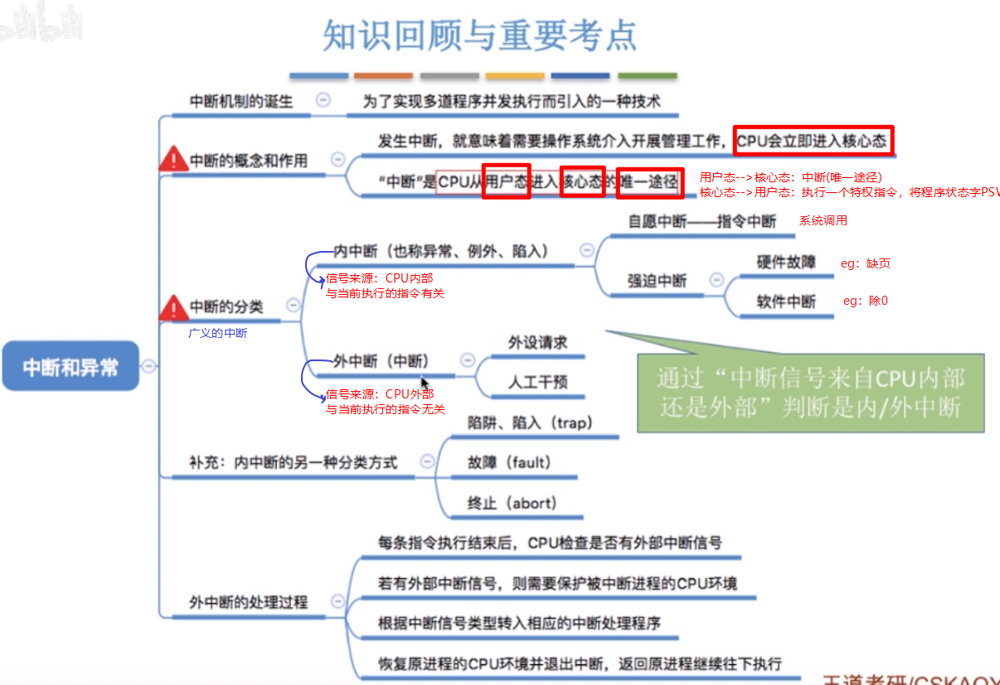

#### 1.6 系统调用

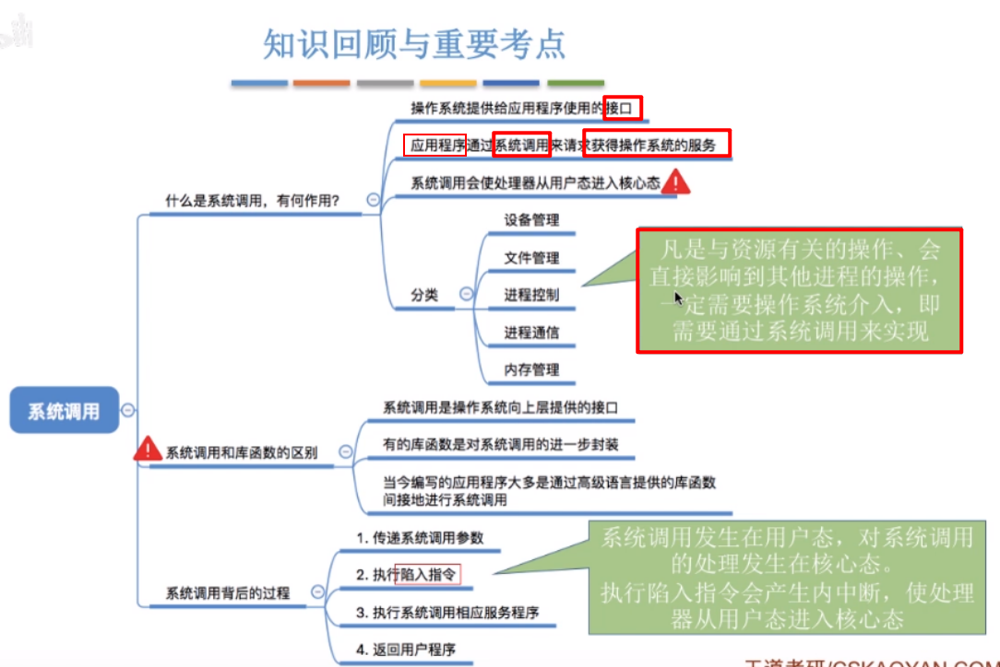

### 2 进程--（动态性）

#### 2.1 进程和线程

##### 进程的定义、组成、组织方式、特征

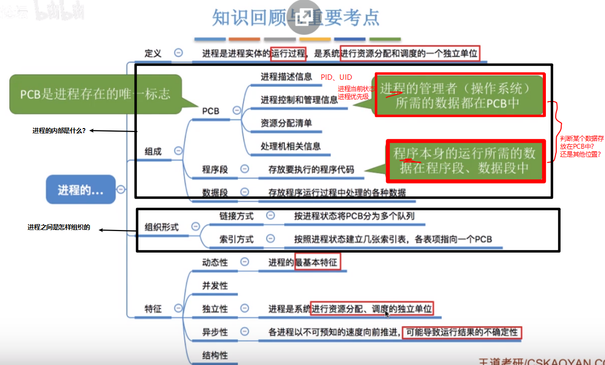

- 注：严格来说，**进程实体**和**进程**并不一样，进程实体是**静态的**（三部分实体），进程则是**动态的**。不过，除非题目专门考察二者的区别，否则可以认为进程实体就是进程。因此我们也可以说“进程由程序段、数据段、PCB三部分组成”

##### 进程的状态与转换

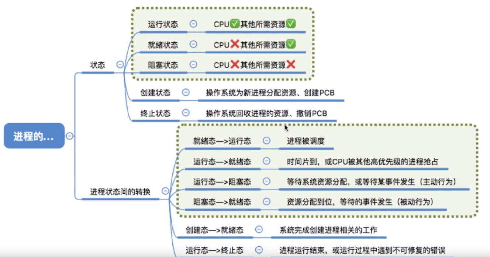

- 进程的状态【5状态模型】

  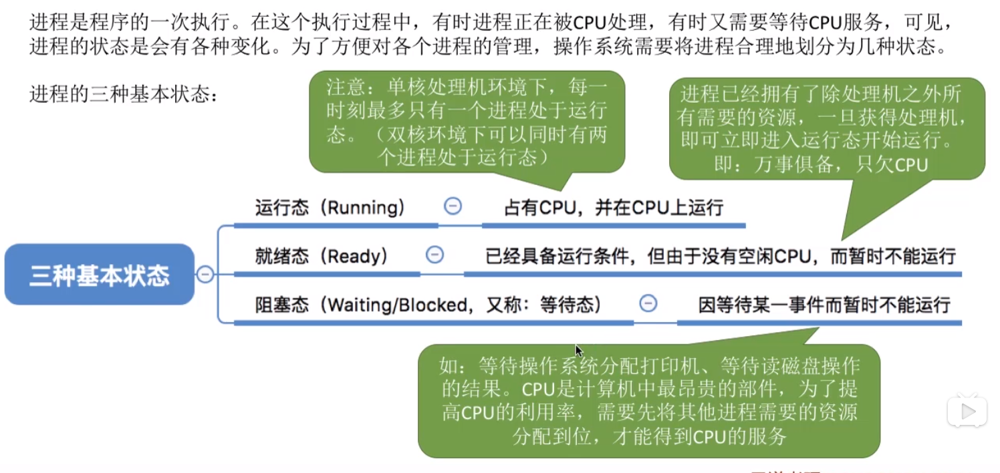

- 进程状态间的转换

  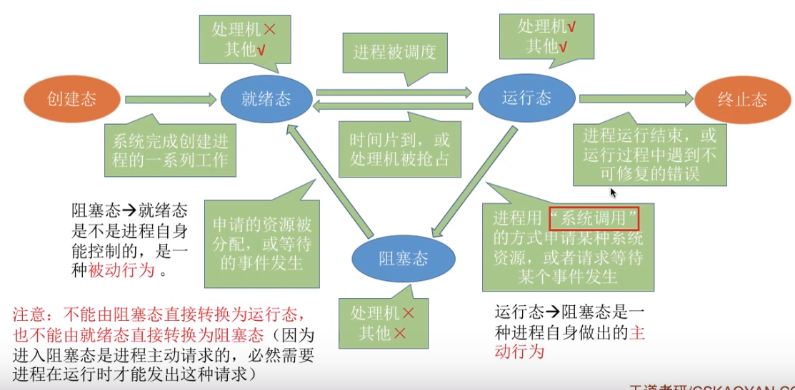

- 【补充，不太重要？】7状态模型

  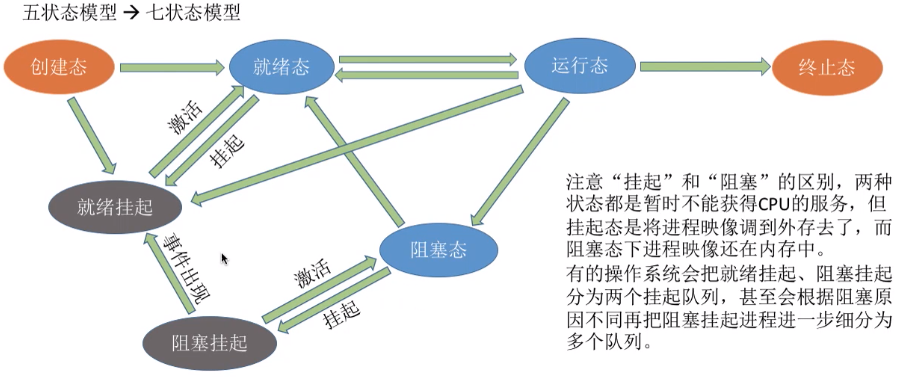

##### 进程控制

- 用**原语**实现进程控制。

  - 原语的特点是<u>执行期间不允许中断，只能一气呵成</u>。（原子操作，类比<u>原子的不可再分性</u>）

  - 原语采用“<u>关中断指令</u>”和“<u>开中断指令</u>”实现

    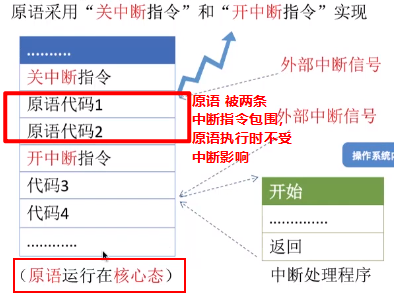

  - 关/开中断指令的权限非常大，必然是**只允许在核心态下执行的特权指令**。

- **原语**做了哪些事情？

  学习技巧：进程控制会导致进程状态的转换。无论哪个原语，要做的无非三类事情：

  - 更新PCB中的信息（如修改进程状态标志、将运行环境保存到PCB、从PCB恢复运行环境）
    - 所有的进程控制原语一定都会修改进程状态标志
    - 剥夺当前运行进程的CPU使用权 必然需要保存其运行环境到PCB
    - 某进程开始运行前必然需要从PCB中恢复其运行环境
  - 将PCB插入合适的队列
  - 分配/回收资源

- 总结

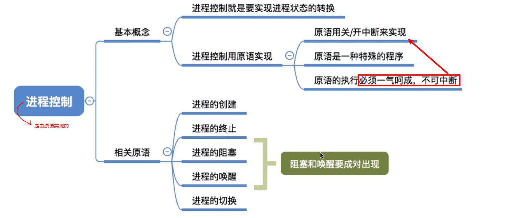

##### 进程通信

- 什么是进程通信？

   指**进程之间的信息交换**。

  （需要明确：进程是分配系统资源的单位，因此**各进程拥有内存地址空间相互独立**，为了保证安全，**一个进程不能直接访问另一个进程的地址空间**）

  虽然不可以相互访问内存空间，但进程之间的信息交换又是必须要实现的。于是 操作系统提供了一些进程通信的方法。如下：

  主要有3种进程通信的方式：

  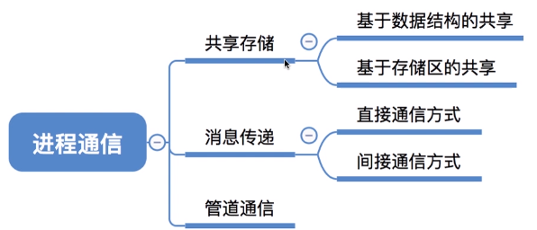

- **共享存储**

  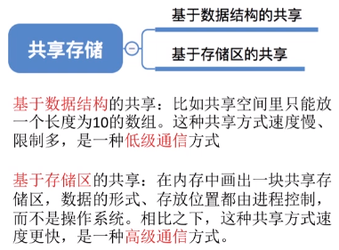

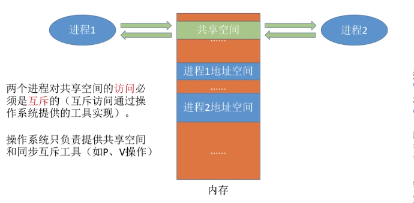

- **管道通信**

  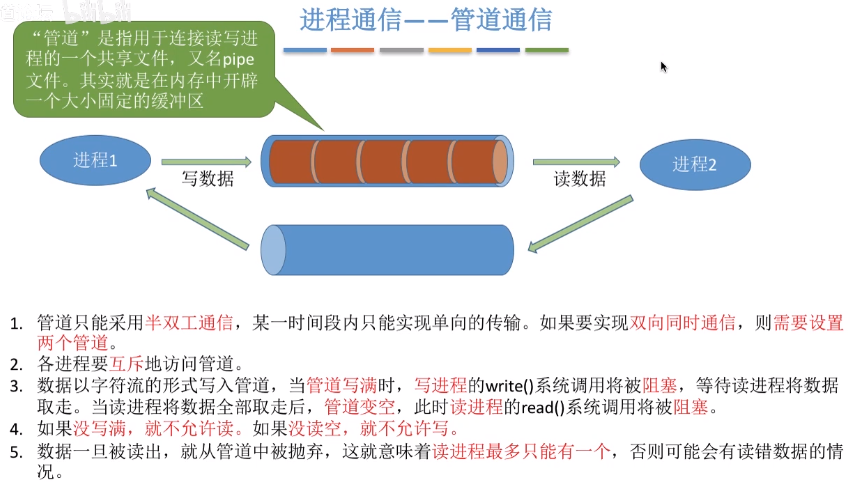

- **消息传递**、

  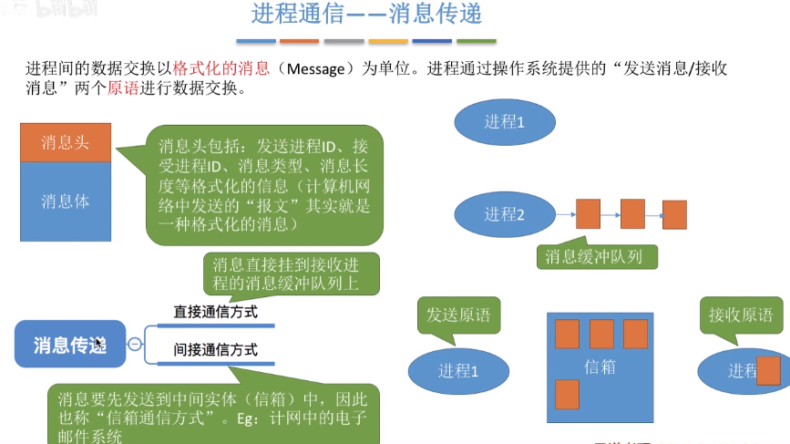

##### 线程概念和多线程模型

- 什么是线程，为什么要引入线程？

  1. 某个进程可能需要**“同时”**做很多事情，而传统的进程只能**串行**的执行一系列程序。为此，**引入了“线程”，来增加并发度**。

  2. 可以把**线程理解为“轻量级进程”**。

  3. 线程是一个**基本的CPU执行单元**，也是**程序执行流的最小单位**。

  4. 引入线程之后，不仅是**进程之间可以并发**，进程内的**各线程之间也可以并发**，从而进一步**提升了系统的并发度**。

  5. 引入线程**之前**，**进程是** **系统资源的分配 +  调度** 的**基本单位**。

     引入线程**之后**，**进程只作为除CPU之外的系统资源的分配单元**；**线程：调度的基本单位**。

     （由上总结：**系统资源是分配给某个进程的**。某个进程中的**多个线程**共享这些资源）

- 引入线程机制后，有什么变化？

  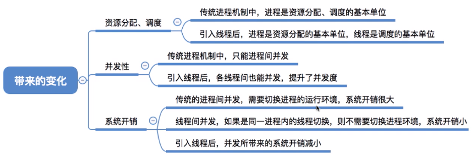

- 线程的属性

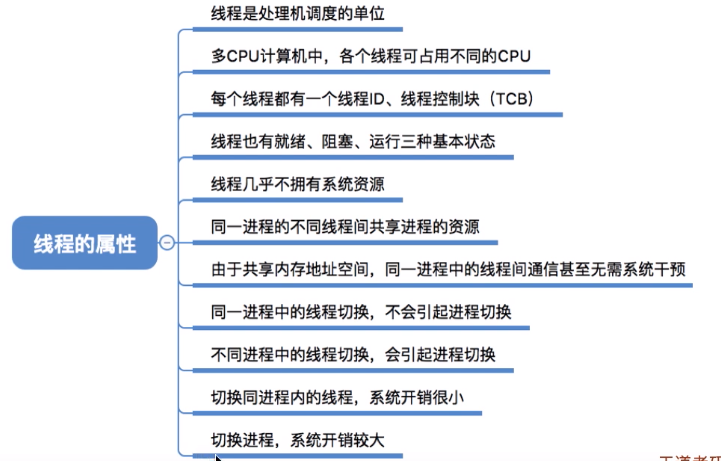

- 线程的实现方式

  - 用户级线程（ULT）

    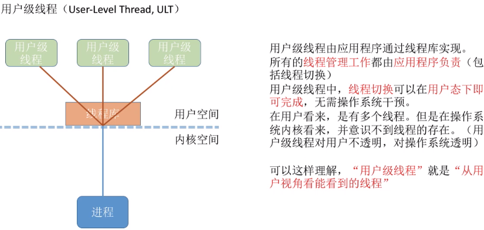

  - 内核级线程（KLT）

    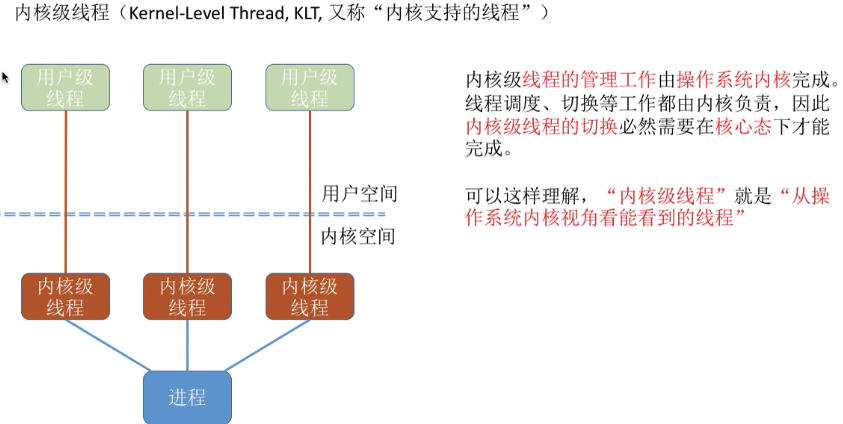
  
  在同时支持**用户级线程**和**内核级线程**的系统中，可采用二者组合的方式：将n个用户级线程映射到m和内核级线程上（n>=m），如下图所示。**[这样做的好处？]**
  
  ​	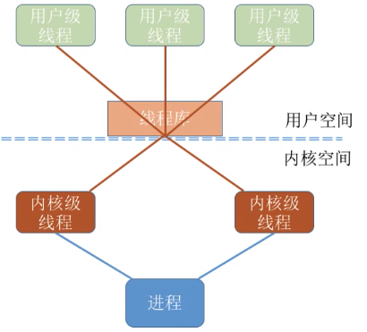
  
  :star::star::star:操作系统只“看得见”内核级线程，因此只有 **内核级线程才是处理机分配单位**。
  
- 多线程模型
  
  问题的引出：在同时支持用户级线程和内核级线程的系统中，由**几个用户级线程**映射到**几个内核级线程**？？？
  
  - 多对一
  
    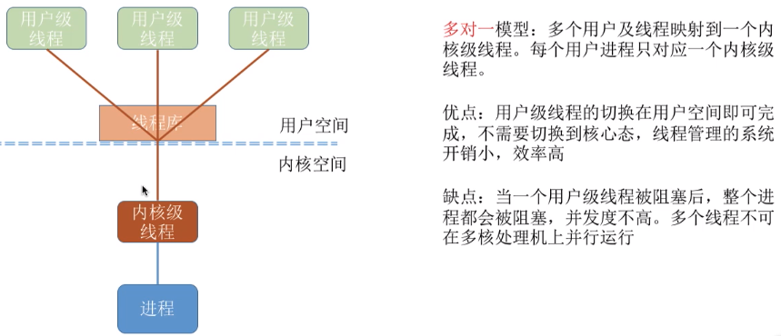
  
  - 一对一
  
    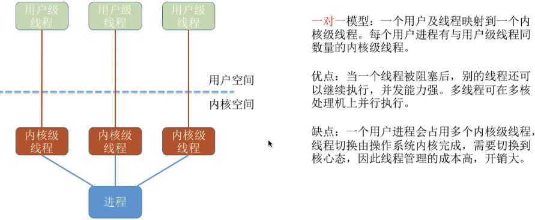
  
  - 多对多
  
    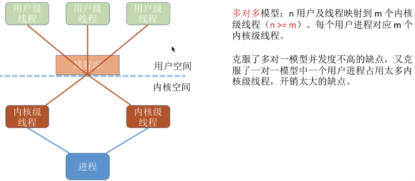
    
  
  综上总结：
  
  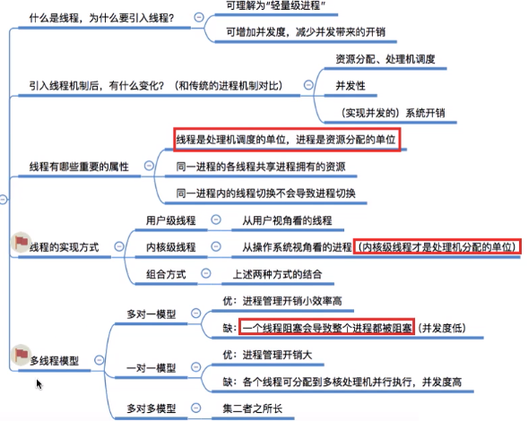

#### 2.2 调度

##### 处理机调度的概念、层次

- 【概念】处理机调度

  从**就绪队列中** **按照一定的算法选择一个进程**并将**处理机分配给它**运行，以实现进程的并发执行。

- 三个层次

  - 高级调度（作业调度）

    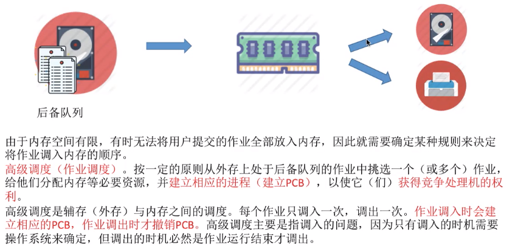

  - 中级调度（内存调度）

    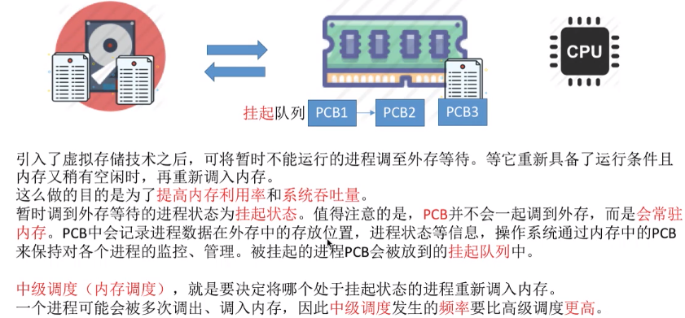

  - 低级调度（进程调度）
  
    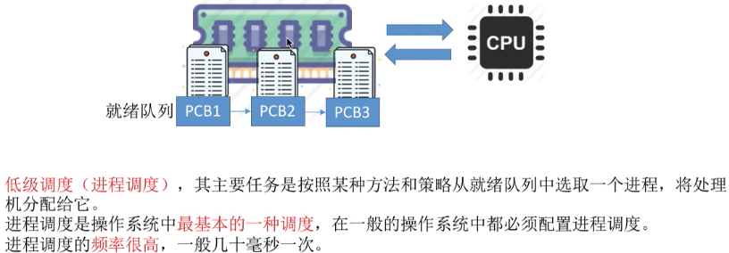

- 三层调度的联系、对比

  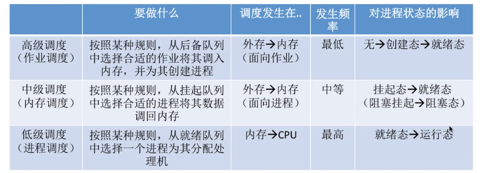

综上：

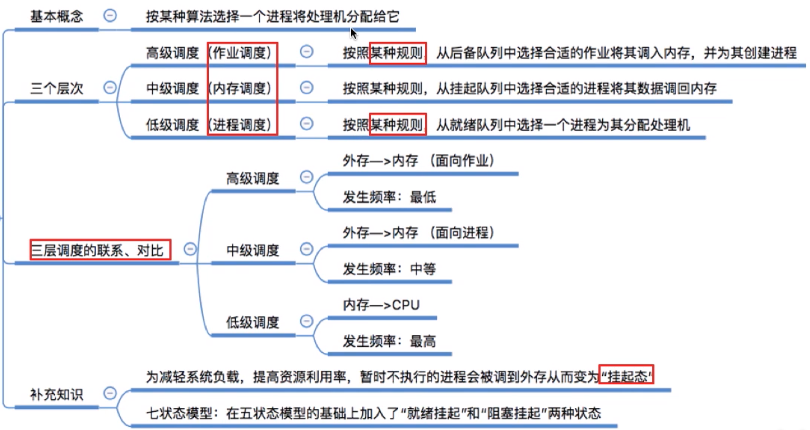

##### 进程调度的时机、切换与过程、方式

##### 调度算法的评价指标

#####  FCFS、SJF、HRRN调度算法

##### 调度算法：时间片轮转、优先级、多级反馈队列

#### 2.3 

##### 进程同步、进程互斥

##### 进程互斥的软件实现方法

##### 进程互斥的硬件实现方法

##### 信号量机制

##### 用信号量实现进程互斥、同步、前驱关系

##### 生产者-消费者问题

##### 多生产者-多消费者问题

##### 吸烟者问题

##### 读者-写者问题

##### 哲学家进餐问题

##### 管程

#### 2.4 死锁

##### 死锁的概念

##### 死锁的处理策略-预防死锁

##### 死锁的处理策略-避免死锁

##### 死锁的处理策略-检测和解除

#### 3 存储与地址

#### 